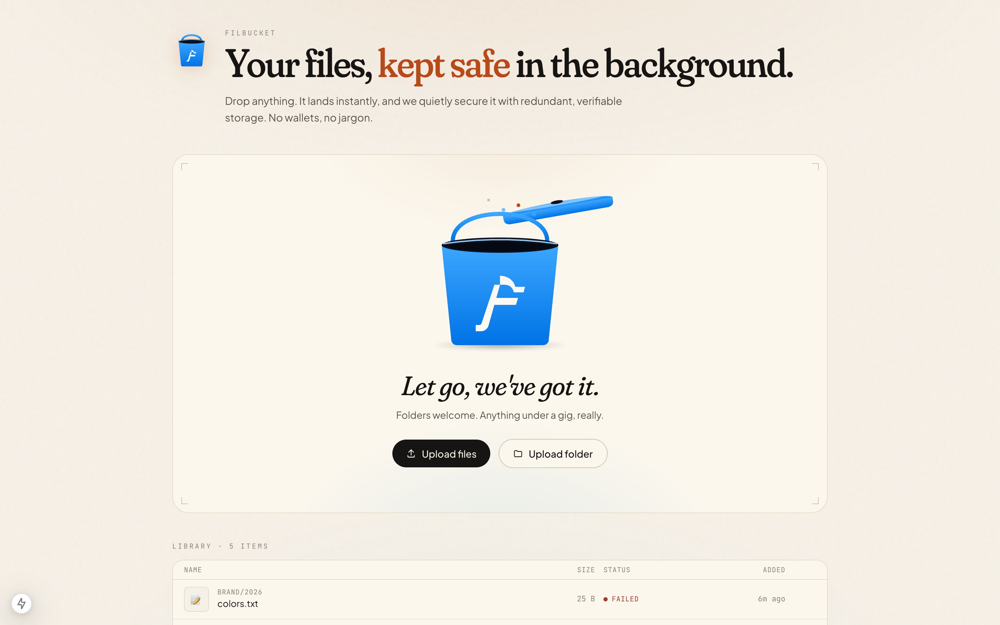
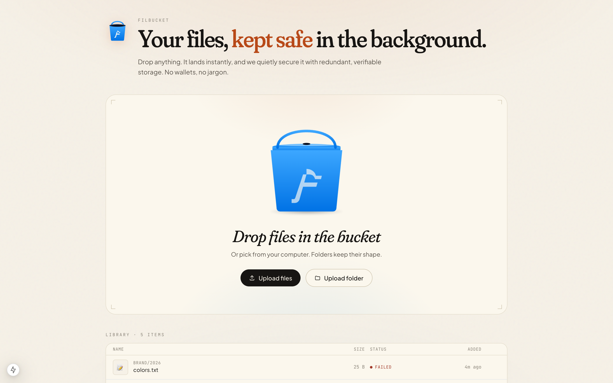
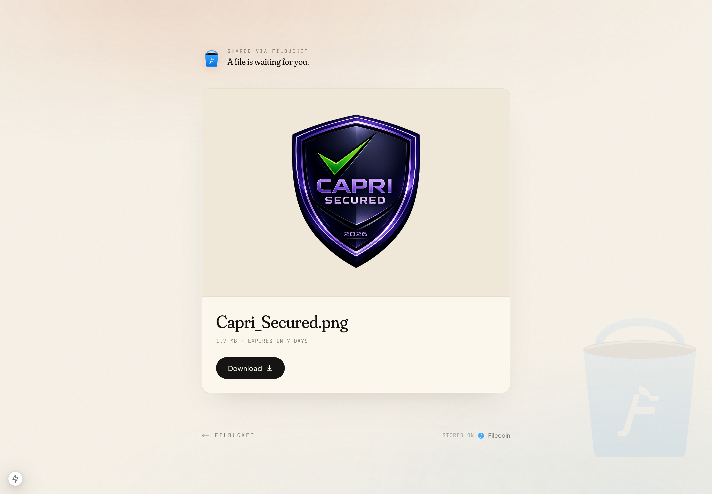
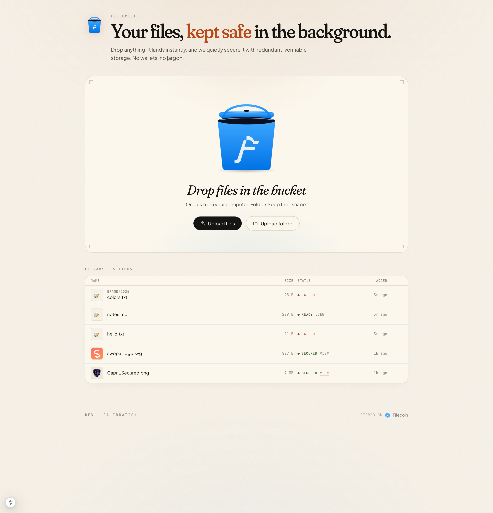
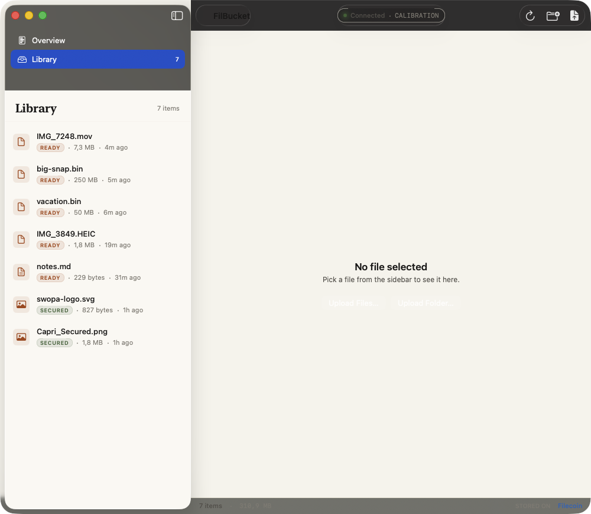
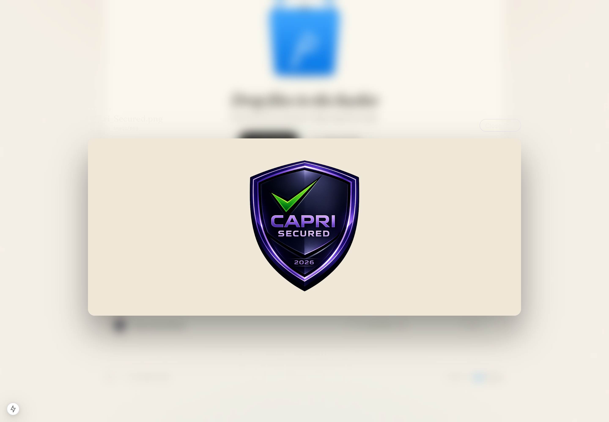
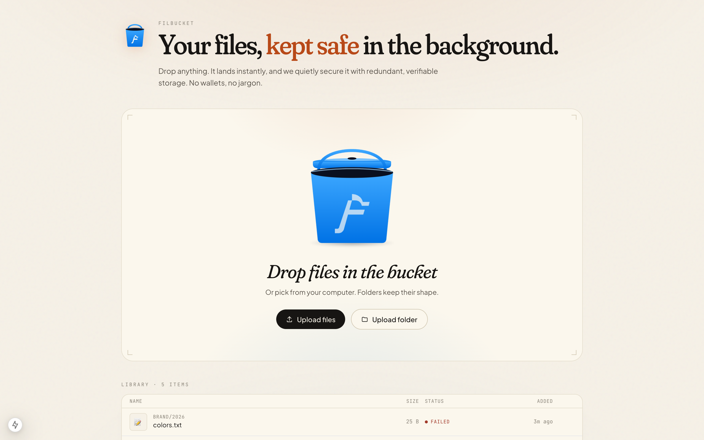

<div align="center">
  

  <h1>FilBucket</h1>

  <p><strong>Dropbox for Filecoin.</strong> Upload, store, and share files with verifiable durability — without ever seeing a wallet, a CID, or a rail.</p>

  <p>
    <a href="#quickstart"></a>
    <a href="./docs/README.md"></a>
    <a href="#status"></a>
    <a href="#license"></a>
    <a href="#architecture"></a>
    
    
  </p>
</div>

---

FilBucket is a file product that happens to use Filecoin. It runs on [**Filecoin Onchain Cloud**](https://docs.filecoin.io/basics/how-filecoin-works/filecoin-onchain-cloud) (PDP, Filecoin Pay, FWSS) through the [**Synapse SDK**](https://github.com/FilOzone/synapse-sdk), but the user never needs to know that.

> **Upload a file.** It lands instantly in hot storage.
> **Wait a few minutes.** It gets replicated across multiple storage providers and cryptographically proven on-chain.
> **Share a link.** Anyone can download — no wallet, no login, no jargon.

---

## Why FilBucket

Most Filecoin products expose the plumbing. FilBucket wins by doing the opposite:

- 📦 **Real product, not a dashboard.** If it feels like crypto, it loses.
- ⚡ **Instant uploads.** Hot cache first; durability happens in the background.
- 🔐 **Verifiable by default.** Every file is replicated across 2+ SPs with continuous PDP proofs.
- 💸 **Fiat billing, USDFC underneath.** Users never hold crypto.
- 🔗 **Beautiful sharing.** Signed links with expiry, password, download limits.
- 🍎 **Native Mac app.** Drag, drop, done.
- 📁 **Folders, streaming, previews.** Image, video, PDF, audio — inline.

---

## Screenshots

<div align="center">
  
  <br/><sub><b>The signature moment</b> — drag files near the bucket; the lid lifts to catch them.</sub>
</div>

<div align="center">
  <table>
    <tr>
      <td width="50%"><br/><sub><b>Home</b> — Fraunces display, warm paper, one accent.</sub></td>
      <td width="50%"><br/><sub><b>Share page</b> — what a recipient sees. No wallet, no login, no Web3 language.</sub></td>
    </tr>
    <tr>
      <td><br/><sub><b>Library</b> — live progress bars, real state transitions, inline image thumbnails.</sub></td>
      <td><br/><sub><b>Native macOS app</b> — SwiftUI, AVKit + PDFKit previews, drag-drop for files and folders.</sub></td>
    </tr>
    <tr>
      <td><br/><sub><b>Inline previews</b> — images, video (with scrubbing), audio, PDF, text.</sub></td>
      <td><br/><sub><b>Library close-up</b> — folder paths preserved, Secured / Ready / Failed states.</sub></td>
    </tr>
  </table>
</div>

---

## Quickstart

### One-line installer (macOS)

```bash
curl -fsSL https://raw.githubusercontent.com/Reiers/filbucket/main/install.sh | bash
```

Sets up Postgres + Redis + MinIO via Homebrew, clones the repo into `~/FilBucket`, generates an ops wallet, opens both faucets in your browser (~10 seconds of clicking), polls until funded, then auto-runs `setup-wallet`. Safe by default, idempotent, `FILBUCKET_YES=1` for non-interactive.

When `get.filbucket.ai` is live, the URL becomes `curl -fsSL https://get.filbucket.ai | bash`.

<details>
<summary>What the installer does</summary>

1. Checks Homebrew, Node 22+, pnpm, git, librsvg.
2. `brew install postgresql@16 redis minio minio-mc` (skips what's already there).
3. `brew services start` each.
4. Creates Postgres role + db + MinIO bucket.
5. Clones `github.com/Reiers/filbucket` into `~/FilBucket`.
6. `pnpm install`.
7. Offers to generate a fresh calibration wallet + writes `.env`.
8. Runs Drizzle migrations + seed.
9. Prints faucet links + the exact `setup-wallet` + `pnpm dev` commands.

No `sudo`. No silent writes outside `~/FilBucket`, `~/.filbucket/`, and Homebrew's own prefix.
</details>

### Prerequisites (if you'd rather go manual)

- **Node 22+** and **pnpm 10**
- **Postgres 16**, **Redis 7**, **MinIO** (via Homebrew on macOS, or Docker elsewhere)
- **Filecoin calibration wallet** with tFIL + USDFC ([tFIL faucet](https://faucet.calibnet.chainsafe-fil.io/funds.html), [USDFC faucet](https://forest-explorer.chainsafe.dev/faucet/calibnet_usdfc))

### Run locally

```bash
git clone https://github.com/Reiers/filbucket.git
cd filbucket
pnpm install

# Start Postgres + Redis + MinIO (macOS / Homebrew)
brew services start postgresql@16
brew services start redis
minio server ~/minio-data --address :9000 --console-address :9001 &

# Initialize DB
createdb -U $USER filbucket
pnpm --filter @filbucket/server db:push --force
pnpm --filter @filbucket/server db:seed   # prints DEV_USER_ID + bucket id

# Create .env at repo root with:
#   FILBUCKET_OPS_PK=0x<your funded calibration PK>
#   FILBUCKET_CHAIN=calibration
#   FILBUCKET_RPC_URL=https://api.calibration.node.glif.io/rpc/v1
#   DEV_USER_ID=<paste from seed>
#   NEXT_PUBLIC_DEV_USER_ID=<same as above>
#   NEXT_PUBLIC_DEFAULT_BUCKET_ID=<paste from seed>
# …and the standard DATABASE_URL / REDIS_URL / S3_* entries (see .env.example)

# One-shot wallet setup (deposits USDFC into Filecoin Pay + approves FWSS)
pnpm --filter @filbucket/server setup-wallet

# Dev
pnpm dev    # web on :3010, api on :4000
```

Open **http://localhost:3010**, drop a file into the bucket, watch it go `Uploading → Ready → Secured`.

### macOS app

```bash
cd apps/mac
./Scripts/compile_and_run.sh
```

Builds a signed `.app` bundle and launches it. Point it at your local server via the Settings sheet if the defaults don't match.

---

## Architecture

```
┌─────────────────────────────────────────────────────────────────┐
│                        FilBucket UI                             │
│    Next.js 15 web · Native macOS arm64 · S3-compat API (soon)   │
└───────────────────────────────┬─────────────────────────────────┘
                                │
┌───────────────────────────────▼─────────────────────────────────┐
│                      FilBucket Backend                          │
│         Fastify · Postgres · Redis · BullMQ · MinIO             │
│                                                                 │
│   Upload  ─►  Hot cache  ─►  Durability worker  ─►  PDP watcher │
└───────────────────────────────┬─────────────────────────────────┘
                                │ Synapse SDK (viem)
┌───────────────────────────────▼─────────────────────────────────┐
│                Filecoin Onchain Cloud (shared)                  │
│                                                                 │
│   PDPVerifier   FilecoinPay   FWSS   ServiceProviderRegistry    │
│                                                                 │
│   Curio SPs (selected via endorsed set, multi-copy by default)  │
└─────────────────────────────────────────────────────────────────┘
```

- **No SP**: FilBucket consumes FOC; we don't run storage providers.
- **No user wallets**: FilBucket is the payer on every rail. Users pay fiat (or nothing, on free tier).
- **No new contracts**: we use FWSS + Filecoin Pay + PDPVerifier as-is.

Full design: [`ARCHITECTURE.md`](./ARCHITECTURE.md). Internal vocabulary + UI translation table: [`GLOSSARY.md`](./GLOSSARY.md).

---

## Features

| | |
|---|---|
| 📤 **Instant uploads** | Hot cache landing in seconds, durability async |
| 🪣 **Interactive bucket** | Drag files onto an animated SVG bucket |
| 📁 **Folder uploads** | Drag a folder, preserve structure |
| 🎞 **Inline previews** | Images, video (with scrubbing), audio, PDF, text |
| 📊 **Live progress** | Per-chunk, per-SP progress events streaming into the UI |
| 🔗 **Share links** | Expiry presets, password, download limits, revoke |
| 🗑 **Delete & dismiss** | Every file, every state |
| 🍎 **macOS native** | SwiftUI drag-drop, AVKit previews, menu bar (coming) |
| 🔐 **Audited access log** | Every share view/download recorded |
| 🧾 **Verifiable durability** | PDP proofs every proving period, rail repair on fault |

---

## Repo layout

```
filbucket/
├── apps/
│   ├── web/            Next.js 15 frontend
│   ├── server/         Fastify API + BullMQ workers
│   └── mac/            Native macOS SwiftUI app
├── packages/
│   └── shared/         TS types + zod schemas
├── infra/
│   └── docker-compose.yml
├── ARCHITECTURE.md     Full design
├── GLOSSARY.md         Internal terms + UI translation rules
├── SPIKE-NOTES.md      Phase 0/1 dev journal
└── TODO.md             Execution queue
```

---

## Pricing (target)

| Tier | Storage | Price |
|---|---|---|
| Free | 10 GB | $0 |
| Personal | 500 GB | $10 / mo |
| Team | 2 TB | $25 / mo |

Unit economics: **$2.50/TiB/mo/copy** (FOC list price) × 2 copies + CDN + ops ≈ 60% gross margin at $10/500 GB.

---

## Documentation

📚 **In-repo docs** under [`docs/`](./docs/) — GitBook-ready (Git Sync via `.gitbook.yaml`); **`docs.filbucket.ai`** publishes once we wire the GitBook side.

Key reads:
- [ARCHITECTURE.md](./ARCHITECTURE.md) — product + infra design
- [GLOSSARY.md](./GLOSSARY.md) — internal vocabulary, UI-facing language rules
- [SPIKE-NOTES.md](./SPIKE-NOTES.md) — dev journal with real findings (Synapse SDK quirks, chain gotchas, decisions)
- [TODO.md](./TODO.md) — what's next

---

## Stack

**Web**
Next.js 15 · React 19 · Tailwind 3 · Framer Motion · **Fraunces** (display) + **Plus Jakarta Sans** (body) + JetBrains Mono

**Backend**
Node 22 · TypeScript · Fastify · Drizzle ORM · Postgres 16 · BullMQ · Redis 7 · MinIO (S3-compat)

**Chain**
`@filoz/synapse-sdk` · `@filoz/synapse-core` · `viem` · `argon2` · Calibration testnet (Phase 0), mainnet soon

**macOS**
SwiftUI · SwiftPM (no Xcode project) · AVKit · PDFKit

---

## Contributing

FilBucket is developed in the open. PRs welcome once the API stabilizes in Phase 1. For now:

- File issues with reproduction steps
- Suggest features via GitHub discussions
- Follow [@filbucket](https://x.com/filbucket) for updates

---

## Status

**Phase 0 (done)** — Scaffold, calibration upload, PDP commit, first-proof watcher, share links.
**Phase 1 (shipping)** — Premium redesign, folder uploads, previews, native Mac app, real auth.
**Phase 2** — Filecoin mainnet, Stripe billing, mobile web polish, aggregation for small files.
**Phase 3** — Team buckets, S3-compatible API, Private Vault (user-held keys), iOS app.

See [ARCHITECTURE §11](./ARCHITECTURE.md#11-roadmap) for the full roadmap.

---

## License

MIT © 2026 FilBucket · Built on [Filecoin](https://filecoin.io).

<div align="center">
  <sub>Files stay safe because  Filecoin never forgets.</sub>
</div>
